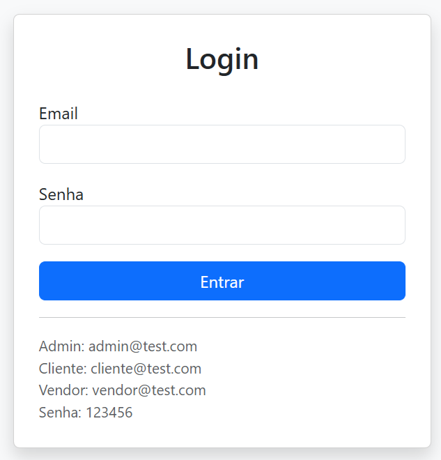
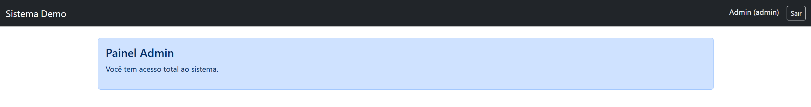
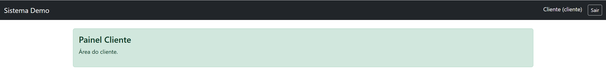
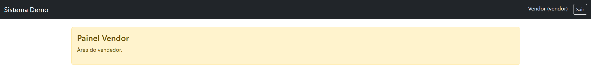

# 🚀 Laravel Multi Auth Demo

<p align="center">
  Sistema de autenticação com múltiplos níveis de acesso (Admin, Cliente e Vendor)
</p>

---

## 🧩 Funcionalidades

* 🔐 Login de usuários
* 👥 Controle de acesso por roles
* 🔁 Redirecionamento automático
* 🛡 Middleware por tipo de usuário
* 🎨 Interface com Bootstrap

---

## 🛠 Tecnologias

* PHP 8+
* Laravel 13+
* SQLite
* Bootstrap 5

---

## ⚙️ Instalação

```bash
git clone https://github.com/roger-RGLweb/laravel-multi-auth-demo.git
cd laravel-multi-auth-demo
composer install
cp .env.example .env
php artisan key:generate
```

---

## 🗄 Configuração do Banco (SQLite)


No arquivo `.env`:

```env
DB_CONNECTION=sqlite
DB_DATABASE=database/database.sqlite
```

---

## ▶️ Rodando o projeto

```bash
php artisan migrate
php artisan db:seed
php artisan serve
```

Acesse: http://127.0.0.1:8000

---

## 🔑 Usuários de teste

| Tipo       | Email                                       | Senha  |
| ---------- | ------------------------------------------- | ------ |
| 👑 Admin   | [admin@test.com](mailto:admin@test.com)     | 123456 |
| 👤 Cliente | [cliente@test.com](mailto:cliente@test.com) | 123456 |
| 🏪 Vendor  | [vendor@test.com](mailto:vendor@test.com)   | 123456 |

---

## 📌 Observações

* Projeto para fins de demonstração
* Utiliza autenticação manual com Auth
* Banco SQLite configurado localmente

---

## 📷 Preview


### 🔐 Tela de Login


### 👑 Painel Admin


### 👤 Painel Cliente


### 🏪 Painel Vendor


---

## 👨‍💻 Autor

Roger Lucena

